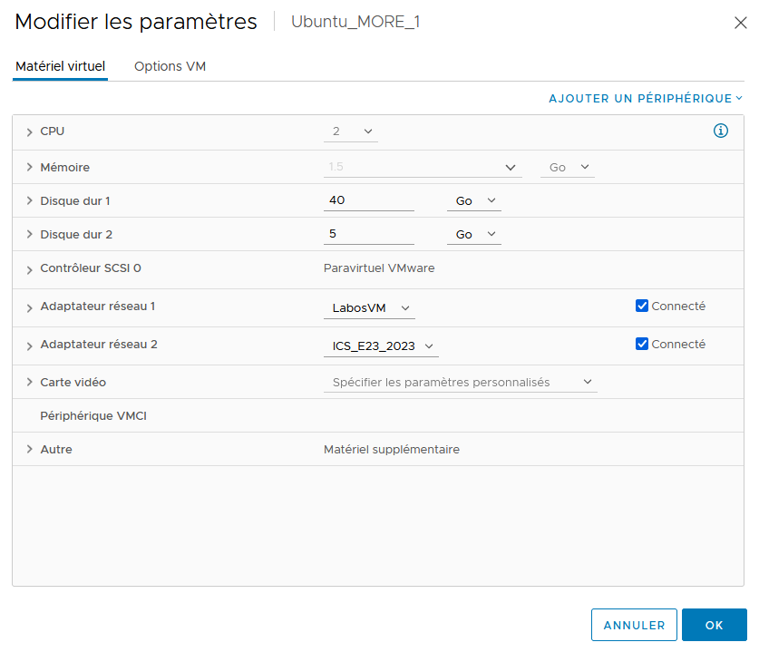

# **MOREL Loïc 3ICS**

## 1. Table des matières

- [**MOREL Loïc 3ICS**](#morel-loïc-3ics)
  - [1. Table des matières](#1-table-des-matières)
  - [Exercice 1. Disques et partitions](#exercice-1-disques-et-partitions)
    - [1. Dans l’interface de configuration de votre VM, créez un second disque dur, de 5 Go dynamiquement alloués ; puis démarrez la VM](#1-dans-linterface-de-configuration-de-votre-vm-créez-un-second-disque-dur-de-5-go-dynamiquement-alloués--puis-démarrez-la-vm)
    - [2. Vérifiez que ce nouveau disque dur est bien détecté par le système](#2-vérifiez-que-ce-nouveau-disque-dur-est-bien-détecté-par-le-système)
    - [3. Partitionnez ce disque en utilisant fdisk : créez une première partition de 2 Go de type Linux (n°83), et une seconde partition de 3 Go en NTFS (n°7)](#3-partitionnez-ce-disque-en-utilisant-fdisk--créez-une-première-partition-de-2-go-de-type-linux-n83-et-une-seconde-partition-de-3-go-en-ntfs-n7)
      - [Création de la première partition de 2 Go](#création-de-la-première-partition-de-2-go)
      - [Création de la première partition de 3 Go](#création-de-la-première-partition-de-3-go)
    - [4. A ce stade, les partitions ont été créées, mais elles n’ont pas été formatées avec leur système de fichiers. A l’aide de la commande mkfs, formatez vos deux partitions ( pensez à consulter le manuel !)](#4-a-ce-stade-les-partitions-ont-été-créées-mais-elles-nont-pas-été-formatées-avec-leur-système-de-fichiers-a-laide-de-la-commande-mkfs-formatez-vos-deux-partitions--pensez-à-consulter-le-manuel-)
    - [5. Pourquoi la commande df -T, qui affiche le type de système de fichier des partitions, ne fonctionne-t- elle pas sur notre disque ?](#5-pourquoi-la-commande-df--t-qui-affiche-le-type-de-système-de-fichier-des-partitions-ne-fonctionne-t--elle-pas-sur-notre-disque-)
    - [6. Faites en sorte que les deux partitions créées soient montées automatiquement au démarrage de la machine, respectivement dans les points de montage /data et /win (vous pourrez vous passer des UUID en raison de l’impossibilité d’effectuer des copier-coller)](#6-faites-en-sorte-que-les-deux-partitions-créées-soient-montées-automatiquement-au-démarrage-de-la-machine-respectivement-dans-les-points-de-montage-data-et-win-vous-pourrez-vous-passer-des-uuid-en-raison-de-limpossibilité-deffectuer-des-copier-coller)
    - [7. Utilisez la commande mount puis redémarrez votre VM pour valider la configuration](#7-utilisez-la-commande-mount-puis-redémarrez-votre-vm-pour-valider-la-configuration)
    - [8. Montez votre clé USB dans la VM](#8-montez-votre-clé-usb-dans-la-vm)
    - [9. Créez un dossier partagé entre votre VM et votre système hôte (rem. il peut être nécessaire d’installer les Additions invité de VirtualBox)](#9-créez-un-dossier-partagé-entre-votre-vm-et-votre-système-hôte-rem-il-peut-être-nécessaire-dinstaller-les-additions-invité-de-virtualbox)
  - [Exercice 2. Partitionnement LVM](#exercice-2-partitionnement-lvm)
    - [1. On va réutiliser le disque de 5 Gio de l’exercice précédent. Commencez par démonter les systèmes de fichiers montés dans /data et /win s’ils sont encore montés, et supprimez les lignes correspondantes du fichier /etc/fstab](#1-on-va-réutiliser-le-disque-de-5-gio-de-lexercice-précédent-commencez-par-démonter-les-systèmes-de-fichiers-montés-dans-data-et-win-sils-sont-encore-montés-et-supprimez-les-lignes-correspondantes-du-fichier-etcfstab)
    - [2. Supprimez les deux partitions du disque, et créez une partition unique de type LVM](#2-supprimez-les-deux-partitions-du-disque-et-créez-une-partition-unique-de-type-lvm)
    - [3. A l’aide de la commande pvcreate, créez un volume physique LVM. Validez qu’il est bien créé, en utilisant la commande pvdisplay.](#3-a-laide-de-la-commande-pvcreate-créez-un-volume-physique-lvm-validez-quil-est-bien-créé-en-utilisant-la-commande-pvdisplay)
    - [4. A l’aide de la commande vgcreate, créez un groupe de volumes, qui pour l’instant ne contiendra que le volume physique créé à l’étape précédente. Vérifiez à l’aide de la commande vgdisplay.](#4-a-laide-de-la-commande-vgcreate-créez-un-groupe-de-volumes-qui-pour-linstant-ne-contiendra-que-le-volume-physique-créé-à-létape-précédente-vérifiez-à-laide-de-la-commande-vgdisplay)
    - [5. Créez un volume logique appelé lvData occupant l’intégralité de l’espace disque disponible.](#5-créez-un-volume-logique-appelé-lvdata-occupant-lintégralité-de-lespace-disque-disponible)
    - [6. Dans ce volume logique, créez une partition que vous formaterez en ext4, puis procédez comme dans l’exercice 1 pour qu’elle soit montée automatiquement, au démarrage de la machine, dans /data.](#6-dans-ce-volume-logique-créez-une-partition-que-vous-formaterez-en-ext4-puis-procédez-comme-dans-lexercice-1-pour-quelle-soit-montée-automatiquement-au-démarrage-de-la-machine-dans-data)
    - [7. Eteignez la VM pour ajouter un second disque (peu importe la taille pour cet exercice). Redémarrez](#7-eteignez-la-vm-pour-ajouter-un-second-disque-peu-importe-la-taille-pour-cet-exercice-redémarrez)
    - [8. Utilisez la commande vgextend <nom_vg> <nom_pv> pour ajouter le nouveau disque au groupe de](#8-utilisez-la-commande-vgextend-nom_vg-nom_pv-pour-ajouter-le-nouveau-disque-au-groupe-de)
    - [9. Utilisez la commande lvresize (ou lvextend) pour agrandir le volume logique. Enfin, il ne faut pas oublier de redimensionner le système de fichiers à l’aide de la commande resize2fs.](#9-utilisez-la-commande-lvresize-ou-lvextend-pour-agrandir-le-volume-logique-enfin-il-ne-faut-pas-oublier-de-redimensionner-le-système-de-fichiers-à-laide-de-la-commande-resize2fs)

## Exercice 1. Disques et partitions

### 1. Dans l’interface de configuration de votre VM, créez un second disque dur, de 5 Go dynamiquement alloués ; puis démarrez la VM



### 2. Vérifiez que ce nouveau disque dur est bien détecté par le système

```bash
sudo fdisk -l

Disk /dev/sdb: 5 GiB, 5368709120 bytes, 10485760 sectors
Disk model: Virtual disk
Units: sectors of 1 * 512 = 512 bytes
Sector size (logical/physical): 512 bytes / 512 bytes
I/O size (minimum/optimal): 512 bytes / 512 bytes
```

### 3. Partitionnez ce disque en utilisant fdisk : créez une première partition de 2 Go de type Linux (n°83), et une seconde partition de 3 Go en NTFS (n°7)

#### Création de la première partition de 2 Go


```bash
sudo fdisk /dev/sdb

g
n
1
2048
+2G
w
```

#### Création de la première partition de 3 Go

```bash
g
n
1
2048
+3G
w

```


### 4. A ce stade, les partitions ont été créées, mais elles n’ont pas été formatées avec leur système de fichiers. A l’aide de la commande mkfs, formatez vos deux partitions ( pensez à consulter le manuel !)

### 5. Pourquoi la commande df -T, qui affiche le type de système de fichier des partitions, ne fonctionne-t- elle pas sur notre disque ?

### 6. Faites en sorte que les deux partitions créées soient montées automatiquement au démarrage de la machine, respectivement dans les points de montage /data et /win (vous pourrez vous passer des UUID en raison de l’impossibilité d’effectuer des copier-coller)

### 7. Utilisez la commande mount puis redémarrez votre VM pour valider la configuration

### 8. Montez votre clé USB dans la VM

### 9. Créez un dossier partagé entre votre VM et votre système hôte (rem. il peut être nécessaire d’installer les Additions invité de VirtualBox)


## Exercice 2. Partitionnement LVM
Dans cet exercice, nous allons aborder le partitionnement LVM, beaucoup plus flexible pour manipuler
les disques et les partitions.
### 1. On va réutiliser le disque de 5 Gio de l’exercice précédent. Commencez par démonter les systèmes de fichiers montés dans /data et /win s’ils sont encore montés, et supprimez les lignes correspondantes du fichier /etc/fstab
### 2. Supprimez les deux partitions du disque, et créez une partition unique de type LVM
 La création d’une partition LVM n’est pas indispensable, mais vivement recommandée quand
on utilise LVM sur un disque entier. En effet, elle permet d’indiquer à d’autres OS ou logiciels de
gestion de disques (qui ne reconnaissent pas forcément le format LVM) qu’il y a des données sur
ce disque.
 Attention à ne pas supprimer la partition système !
### 3. A l’aide de la commande pvcreate, créez un volume physique LVM. Validez qu’il est bien créé, en utilisant la commande pvdisplay.
 Toutes les commandes concernant les volumes physiques commencent par pv. Celles concernant
les groupes de volumes commencent par vg, et celles concernant les volumes logiques par lv.
### 4. A l’aide de la commande vgcreate, créez un groupe de volumes, qui pour l’instant ne contiendra que le volume physique créé à l’étape précédente. Vérifiez à l’aide de la commande vgdisplay.
 Par convention, on nomme généralement les groupes de volumes vgxx (où xx représente l’indice
du groupe de volume, en commençant par 00, puis 01...)
### 5. Créez un volume logique appelé lvData occupant l’intégralité de l’espace disque disponible.
 On peut renseigner la taille d’un volume logique soit de manière absolue avec l’option -L (par
exemple -L 10G pour créer un volume de 10 Gio), soit de manière relative avec l’option -l : -l
60%VG pour utiliser 60% de l’espace total du groupe de volumes, ou encore -l 100%FREE pour
utiliser la totalité de l’espace libre.
### 6. Dans ce volume logique, créez une partition que vous formaterez en ext4, puis procédez comme dans l’exercice 1 pour qu’elle soit montée automatiquement, au démarrage de la machine, dans /data.
 A ce stade, l’utilité de LVM peut paraître limitée. Il trouve tout son intérêt quand on veut par
exemple agrandir une partition à l’aide d’un nouveau disque.
### 7. Eteignez la VM pour ajouter un second disque (peu importe la taille pour cet exercice). Redémarrez
la VM, vérifiez que le disque est bien présent. Puis, répétez les questions 2 et 3 sur ce nouveau disque.
### 8. Utilisez la commande vgextend <nom_vg> <nom_pv> pour ajouter le nouveau disque au groupe de
volumes
### 9. Utilisez la commande lvresize (ou lvextend) pour agrandir le volume logique. Enfin, il ne faut pas oublier de redimensionner le système de fichiers à l’aide de la commande resize2fs.
 Il est possible d’aller beaucoup plus loin avec LVM, par exemple en créant des volumes par
bandes (l’équivalent du RAID 0) ou du mirroring (RAID 1). Le but de cet exercice n’était que de
présenter les fonctionnalités de base.