# **MOREL Loïc 3ICS**

## 1. Table des matières

- [**MOREL Loïc 3ICS**](#morel-loïc-3ics)
  - [1. Table des matières](#1-table-des-matières)
  - [Exercice 1. Adressage IP (rappels)](#exercice-1-adressage-ip-rappels)
    - [Solution](#solution)
  - [Exercice 2. Préparation de l’environnement](#exercice-2-préparation-de-lenvironnement)
    - [1. VM éteintes, utilisez les outils de configuration de VirtualBox pour mettre en place l’environnement décrit ci-dessus.](#1-vm-éteintes-utilisez-les-outils-de-configuration-de-virtualbox-pour-mettre-en-place-lenvironnement-décrit-ci-dessus)
    - [2. Démarrez le serveur et vérifiez que les interfaces réseau sont bien présentes. A quoi correspond l’interface appelée lo ?](#2-démarrez-le-serveur-et-vérifiez-que-les-interfaces-réseau-sont-bien-présentes-a-quoi-correspond-linterface-appelée-lo-)
    - [3.  Dans les versions récentes, Ubuntu installe d’office le paquet cloud-init lors de la configuration du système. Ce paquet permet la configuration et le déploiement de machines dans le cloud via un script au démarrage. Nous ne nous en servirons pas et sa présence interfère avec certains services (en particulier le changement de nom d’hôte) ; par ailleurs, vos machines démarreront plus rapidement. Désinstallez complètement ce paquet (il faudra penser à le faire également sur le client ensuite.)](#3--dans-les-versions-récentes-ubuntu-installe-doffice-le-paquet-cloud-init-lors-de-la-configuration-du-système-ce-paquet-permet-la-configuration-et-le-déploiement-de-machines-dans-le-cloud-via-un-script-au-démarrage-nous-ne-nous-en-servirons-pas-et-sa-présence-interfère-avec-certains-services-en-particulier-le-changement-de-nom-dhôte--par-ailleurs-vos-machines-démarreront-plus-rapidement-désinstallez-complètement-ce-paquet-il-faudra-penser-à-le-faire-également-sur-le-client-ensuite)
    - [4. Les deux machines serveur et client se trouveront sur le domaine tpadmin.local. A l’aide de la commande hostnamectl renommez le serveur (le changement doit persister après redémarrage, donc cherchez les bonnes options dans le manuel !). On peut afficher le nom et le domaine d’une machine avec les commandes hostname et/ou dnsdomainname ou en affichant le contenu du fichier /etc/hostname.](#4-les-deux-machines-serveur-et-client-se-trouveront-sur-le-domaine-tpadminlocal-a-laide-de-la-commande-hostnamectl-renommez-le-serveur-le-changement-doit-persister-après-redémarrage-donc-cherchez-les-bonnes-options-dans-le-manuel--on-peut-afficher-le-nom-et-le-domaine-dune-machine-avec-les-commandes-hostname-etou-dnsdomainname-ou-en-affichant-le-contenu-du-fichier-etchostname)
  - [Exercice 3. Installation du serveur DHCP](#exercice-3-installation-du-serveur-dhcp)
    - [1. Sur le serveur, installez le paquet isc-dhcp-server. La commande systemctl status isc-dhcp-server devrait vous indiquer que le serveur n’a pas réussi à démarrer, ce qui est normal puisqu’il n’est pas encore configuré (en particulier, il n’a pas encore d’adresses IP à distribuer).](#1-sur-le-serveur-installez-le-paquet-isc-dhcp-server-la-commande-systemctl-status-isc-dhcp-server-devrait-vous-indiquer-que-le-serveur-na-pas-réussi-à-démarrer-ce-qui-est-normal-puisquil-nest-pas-encore-configuré-en-particulier-il-na-pas-encore-dadresses-ip-à-distribuer)
    - [2. Un serveur DHCP a besoin d’une IP statique. Attribuez de manière permanente l’adresse IP 192.168.100.1 à l’interface réseau du réseau interne. Vérifiez que la configuration est correcte.](#2-un-serveur-dhcp-a-besoin-dune-ip-statique-attribuez-de-manière-permanente-ladresse-ip-1921681001-à-linterface-réseau-du-réseau-interne-vérifiez-que-la-configuration-est-correcte)
    - [3. La configuration du serveur DHCP se fait via le fichier /etc/dhcp/dhcpd.conf. Faites une sauvegarde du fichier existant sous le nom dhcpd.conf.bak puis éditez le fichier dhcpd.conf avec les informations  suivantes :](#3-la-configuration-du-serveur-dhcp-se-fait-via-le-fichier-etcdhcpdhcpdconf-faites-une-sauvegarde-du-fichier-existant-sous-le-nom-dhcpdconfbak-puis-éditez-le-fichier-dhcpdconf-avec-les-informations--suivantes-)
    - [4. Editez le fichier /etc/default/isc-dhcp-server afin de spécifier l’interface sur laquelle le serveur doit écouter.](#4-editez-le-fichier-etcdefaultisc-dhcp-server-afin-de-spécifier-linterface-sur-laquelle-le-serveur-doit-écouter)
    - [5. Validez votre fichier de configuration avec la commande dhcpd -t puis redémarrez le serveur DHCP (avec la commande systemctl restart isc-dhcp-server) et vérifiez qu’il est actif.](#5-validez-votre-fichier-de-configuration-avec-la-commande-dhcpd--t-puis-redémarrez-le-serveur-dhcp-avec-la-commande-systemctl-restart-isc-dhcp-server-et-vérifiez-quil-est-actif)
    - [6. Notre serveur DHCP est configuré ! Passons désormais au client. Si vous avez suivi le sujet du TP 1,](#6-notre-serveur-dhcp-est-configuré--passons-désormais-au-client-si-vous-avez-suivi-le-sujet-du-tp-1)
    - [7. La commande tail -f /var/log/syslog affiche de manière continue les dernières lignes du fichier de log du système (dès qu’une nouvelle ligne est écrite à la fin du fichier, elle est affichée à l’écran).](#7-la-commande-tail--f-varlogsyslog-affiche-de-manière-continue-les-dernières-lignes-du-fichier-de-log-du-système-dès-quune-nouvelle-ligne-est-écrite-à-la-fin-du-fichier-elle-est-affichée-à-lécran)
    - [8. Que contient le fichier /var/lib/dhcp/dhcpd.leases sur le serveur, et qu’afficle la commande dhcp-lease-list ?](#8-que-contient-le-fichier-varlibdhcpdhcpdleases-sur-le-serveur-et-quafficle-la-commande-dhcp-lease-list-)
    - [9. Vérifiez que les deux machines peuvent communiquer via leur adresse IP, à l’aide de la commande ping.](#9-vérifiez-que-les-deux-machines-peuvent-communiquer-via-leur-adresse-ip-à-laide-de-la-commande-ping)
    - [10. Modifiez la configuration du serveur pour que l’interface réseau du client reçoive l’IP statique 192.168.100.20 :](#10-modifiez-la-configuration-du-serveur-pour-que-linterface-réseau-du-client-reçoive-lip-statique-19216810020-)
  - [Exercice 4. Donner un accès à Internet au client](#exercice-4-donner-un-accès-à-internet-au-client)
    - [1. La première chose à faire est d’autoriser l’IP forwarding sur le serveur (désactivé par défaut, étant donné que la plupart des utilisateurs n’en ont pas besoin). Pour cela, il suffit de décommenter la ligne](#1-la-première-chose-à-faire-est-dautoriser-lip-forwarding-sur-le-serveur-désactivé-par-défaut-étant-donné-que-la-plupart-des-utilisateurs-nen-ont-pas-besoin-pour-cela-il-suffit-de-décommenter-la-ligne)
    - [2. Ensuite, il faut autoriser la traduction d’adresse source (masquerading) en ajoutant la règle iptables](#2-ensuite-il-faut-autoriser-la-traduction-dadresse-source-masquerading-en-ajoutant-la-règle-iptables)
  - [Exercice 5. Installation du serveur DNS](#exercice-5-installation-du-serveur-dns)
    - [1. Sur le serveur, commencez par installer bind9, puis assurez-vous que le service est bien actif.](#1-sur-le-serveur-commencez-par-installer-bind9-puis-assurez-vous-que-le-service-est-bien-actif)
    - [2. A ce stade, Bind n’est pas configuré et ne fait donc pas grand chose. L’une des manières les simples de le configurer est d’en faire un serveur cache : il ne fait rien à part mettre en cache les réponses de serveurs externes à qui il transmet la requête de résolution de nom.](#2-a-ce-stade-bind-nest-pas-configuré-et-ne-fait-donc-pas-grand-chose-lune-des-manières-les-simples-de-le-configurer-est-den-faire-un-serveur-cache--il-ne-fait-rien-à-part-mettre-en-cache-les-réponses-de-serveurs-externes-à-qui-il-transmet-la-requête-de-résolution-de-nom)
    - [3. Sur le client, retentez un ping sur www.google.fr. Cette fois ça devrait marcher ! On valide ainsi la configuration du DHCP effectuée précédemment, puisque c’est grâce à elle que le client a trouvé son serveur DNS.](#3-sur-le-client-retentez-un-ping-sur-wwwgooglefr-cette-fois-ça-devrait-marcher--on-valide-ainsi-la-configuration-du-dhcp-effectuée-précédemment-puisque-cest-grâce-à-elle-que-le-client-a-trouvé-son-serveur-dns)
    - [4. Sur le client, installez le navigateur en mode texte lynx et essayez de surfer sur fr.wikipedia.org (bienvenue dans le passé...)](#4-sur-le-client-installez-le-navigateur-en-mode-texte-lynx-et-essayez-de-surfer-sur-frwikipediaorg-bienvenue-dans-le-passé)
  - [Exercice 6. Configuration du serveur DNS pour la zone tpadmin.local](#exercice-6-configuration-du-serveur-dns-pour-la-zone-tpadminlocal)
    - [1. Modifiez le fichier /etc/bind/named.conf.local et ajoutez les lignes suivantes :](#1-modifiez-le-fichier-etcbindnamedconflocal-et-ajoutez-les-lignes-suivantes-)
    - [2. Créez une copie appelée db.tpadmin.local du fichier db.local. Ce fichier est un fichier configuration typique de DNS, constitué d’enregistrements DNS (cf. cours). Dans le nouveau fichier, remplacez toutes les références à localhost par tpadmin local, et l’adresse 127.0.0.1 par l’adresse IP du serveur.](#2-créez-une-copie-appelée-dbtpadminlocal-du-fichier-dblocal-ce-fichier-est-un-fichier-configuration-typique-de-dns-constitué-denregistrements-dns-cf-cours-dans-le-nouveau-fichier-remplacez-toutes-les-références-à-localhost-par-tpadmin-local-et-ladresse-127001-par-ladresse-ip-du-serveur)
    - [3. Maintenant que nous avons configuré notre fichier de zone, il reste à configurer le fichier de zone inverse, qui permet de convertir une adresse IP en nom.](#3-maintenant-que-nous-avons-configuré-notre-fichier-de-zone-il-reste-à-configurer-le-fichier-de-zone-inverse-qui-permet-de-convertir-une-adresse-ip-en-nom)
    - [4. Utilisez les utilitaires named-checkconf et named-checkzone pour valider vos fichiers de configuration :](#4-utilisez-les-utilitaires-named-checkconf-et-named-checkzone-pour-valider-vos-fichiers-de-configuration-)
    - [5. Redémarrer le serveur Bind9. Vous devriez maintenant être en mesure de « pinguer »les différentes machines du réseau.](#5-redémarrer-le-serveur-bind9-vous-devriez-maintenant-être-en-mesure-de--pinguer-les-différentes-machines-du-réseau)


## Exercice 1. Adressage IP (rappels)
Vous administrez le réseau interne 172.16.0.0/23 d’une entreprise, et devez gérer un parc de 254 machines
réparties en 7 sous-réseaux. La répartition des machines est la suivante :
- Sous-réseau 1 : 38 machines
- Sous-réseau 2 : 33 machines
- Sous-réseau 3 : 52 machines
- Sous-réseau 4 : 35 machines
- Sous-réseau 5 : 34 machines
- Sous-réseau 6 : 37 machines
- Sous-réseau 7 : 25 machines

Donnez, pour chaque sous-réseau, Nombre de machines, l’adresse de sous-réseau, l’adresse de broadcast (multidiffusion) ainsi
que les adresses de la première et dernière machine configurées (précisez si vous utilisez du VLSM ou pas).

### Solution

| Sous-réseau | Nombre de machines | CIDR | Adresse de sous-réseau | Adresse de broadcast | Adresse de la première machine | Adresse de la dernière machine |
|-------------|--------------------|------|------------------------|----------------------|-------------------------------|--------------------------------|
| 1           | 38                 | /26  |172.16.1.120|172.16.1.159| 172.16.1.129 | 172.16.1.158
| 2           | 33                 | /26  |172.16.1.64|172.16.1.127|172.16.1.65 | 172.16.1.126
| 3           | 52                 | /26  |172.16.1.0|172.16.1.63| 172.16.1.1 | 172.16.1.62
| 4           | 35                 | /26  |172.16.0.192|172.16.0.255|172.16.0.193 | 172.16.0.254
| 5           | 34                 | /26  |172.16.0.128|172.16.0.191| 172.16.0.129 | 172.16.0.190
| 6           | 37                 | /26  |172.16.0.64|172.16.0.127| 172.16.0.65 | 172.16.0.126
| 7           | 25                 | /27  |172.16.0.1|172.16.0.63|  172.16.0.1 | 172.16.0.62 |


## Exercice 2. Préparation de l’environnement
Dans ce TP nous allons mettre en place un réseau rudimentaire constitué de seulement deux machines :
un serveur et un client :
- le serveur a une connexion Internet, notamment pour télécharger les paquets nécessaires à l’installation
des serveurs, et sert de passerelle au client ;
- les deux machines appartiennent à un réseau local ;
- le client a accès à Internet uniquement via le serveur ; il dispose d’une interface réseau qui recevra son
adresse IP du serveur DHCP. Dans un premier temps, cette interface sera activée mais débranchée.

### 1. VM éteintes, utilisez les outils de configuration de VirtualBox pour mettre en place l’environnement décrit ci-dessus. 


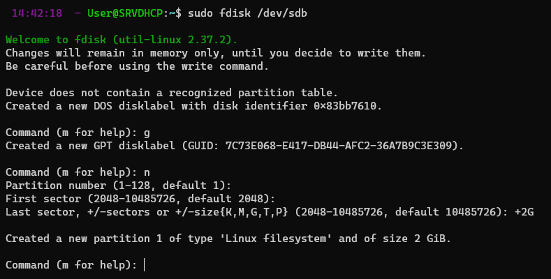


### 2. Démarrez le serveur et vérifiez que les interfaces réseau sont bien présentes. A quoi correspond l’interface appelée lo ?

L'interface lo correspond à la boucle locale. Elle permet de faire des boucles de test sur la machine elle-même.

### 3.  Dans les versions récentes, Ubuntu installe d’office le paquet cloud-init lors de la configuration du système. Ce paquet permet la configuration et le déploiement de machines dans le cloud via un script au démarrage. Nous ne nous en servirons pas et sa présence interfère avec certains services (en particulier le changement de nom d’hôte) ; par ailleurs, vos machines démarreront plus rapidement. Désinstallez complètement ce paquet (il faudra penser à le faire également sur le client ensuite.)

```bash
sudo apt-get purge cloud-init
```

### 4. Les deux machines serveur et client se trouveront sur le domaine tpadmin.local. A l’aide de la commande hostnamectl renommez le serveur (le changement doit persister après redémarrage, donc cherchez les bonnes options dans le manuel !). On peut afficher le nom et le domaine d’une machine avec les commandes hostname et/ou dnsdomainname ou en affichant le contenu du fichier /etc/hostname.
 Il se peut que l’ancien nom persiste dans le fichier /etc/hosts, associé à l’adresse IP 127.0.1.1 ; si
c’est le cas, modifiez ce fichier à la main.
 ISC DHCP Server utilise le temps UTC, qui diffère de l’heure locale française. C’est pourquoi vous
pourrez observer une différence entre la machine virtuelle et la machine hôte.

Server DHCP:

```bash
sudo hostnamectl set-hostname SRVDHCP.tpadmin.local
reboot
```

## Exercice 3. Installation du serveur DHCP
Un serveur DHCP permet aux ordinateurs clients d’obtenir automatiquement une configuration réseau (adresse IP, serveur DNS, passerelle par défaut...), pour une durée déterminée. Ainsi, dans notre cas, l’inter-
faces réseau de client doit être configurée automatiquement par serveur. Le réseau local tpadmin.local
a pour adresse 192.168.100.0/24 (on aurait pu choisir une autre adresse ; attention, 192.168.1.0/24 est
souvent réservée, par exemple par votre FAI).

### 1. Sur le serveur, installez le paquet isc-dhcp-server. La commande systemctl status isc-dhcp-server devrait vous indiquer que le serveur n’a pas réussi à démarrer, ce qui est normal puisqu’il n’est pas encore configuré (en particulier, il n’a pas encore d’adresses IP à distribuer).

```bash
sudo apt-get install isc-dhcp-server
```

Resultat:

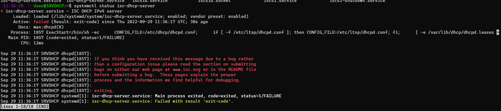

### 2. Un serveur DHCP a besoin d’une IP statique. Attribuez de manière permanente l’adresse IP 192.168.100.1 à l’interface réseau du réseau interne. Vérifiez que la configuration est correcte.

```bash
sudo nano /etc/netplan/50-cloud-init.yaml
```

```bash
network:
    ethernets:
        ens192:
            dhcp4: true
            match:
                macaddress: 00:50:56:89:a6:23
            set-name: ens192
        ens224:
            dhcp4: false
            addresses:
              - 192.168.100.1/24
            match:
                macaddress: 00:50:56:89:6f:82
            set-name: ens224
    version: 2
```

### 3. La configuration du serveur DHCP se fait via le fichier /etc/dhcp/dhcpd.conf. Faites une sauvegarde du fichier existant sous le nom dhcpd.conf.bak puis éditez le fichier dhcpd.conf avec les informations  suivantes :
```text
default-lease-time 120;
max-lease-time 600;
authoritative; #DHCP officiel pour notre réseau
option broadcast-address 192.168.100.255; #informe les clients de l'adresse de broadcast
option domain-name "tpadmin.local"; #tous les hôtes qui se connectent au
#réseau auront ce nom de domaine
subnet 192.168.100.0 netmask 255.255.255.0 { #configuration du sous-réseau 192.168.100.0
range 192.168.100.100 192.168.100.240; #pool d'adresses IP attribuables
option routers 192.168.100.1; #le serveur sert de passerelle par défaut
option domain-name-servers 192.168.100.1; #le serveur sert aussi de serveur DNS
}
```

```bash
sudo cp /etc/dhcp/dhcpd.conf /etc/dhcp/dhcpd.conf.bak
sudo nano /etc/dhcp/dhcpd.conf
```


A quoi correspondent les deux premières lignes ?
 Les valeurs indiquées sur ces deux lignes sont faibles, afin que l’on puisse voir constituer quelques
logs durant ce TP. Dans un environnement de production, elles sont beaucoup plus élevées !

Les deux premières lignes correspondent au temps de location d'une adresse IP par le serveur DHCP. La première ligne correspond au temps de location par défaut et la deuxième ligne correspond au temps maximum de location.

### 4. Editez le fichier /etc/default/isc-dhcp-server afin de spécifier l’interface sur laquelle le serveur doit écouter.

```bash
sudo nano /etc/default/isc-dhcp-server
```

```bash
INTERFACESv4="ens224"
```

### 5. Validez votre fichier de configuration avec la commande dhcpd -t puis redémarrez le serveur DHCP (avec la commande systemctl restart isc-dhcp-server) et vérifiez qu’il est actif.

```bash
sudo dhcpd -t
sudo systemctl restart isc-dhcp-server
sudo systemctl status isc-dhcp-server
```
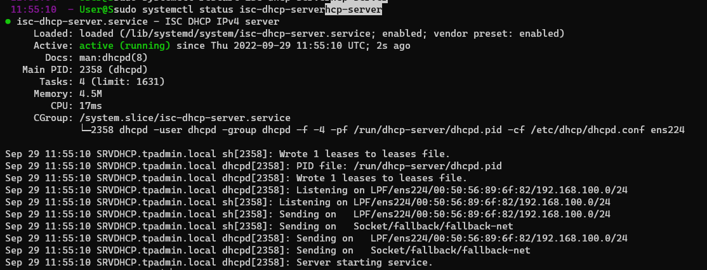

### 6. Notre serveur DHCP est configuré ! Passons désormais au client. Si vous avez suivi le sujet du TP 1,
le client a été créé en clonant la machine virtuelle du serveur. Par conséquent, son nom d’hôte est toujours serveur. Vérifiez que la carte réseau du client est débranchée, puis démarrez le client (il
est possible qu’il mette un certain temps à démarrer : ceci est dû à l’absence de connexion Internet).
Comme pour le serveur, désinstallez ensuite cloud-init, puis modifiez le nom de la machine (elle doit
s’appeler client.tpadmin.local).
 Pour empêcher la latence au démarrage si une machine n’a pas de connexion Internet, on peut ajouter
la ligne optional: true dans son fichier de configuration /etc/netplan/00-installer-config.yaml
 Il est possible que les commandes sudo prennent désormais un certain temps à s’exécuter sur le
client. C’est parce que sudo utilise le fichier /etc/hosts qui contient l’ancien nom de la machine. Il
faut modifier ce fichier à la main si vous rencontrer ce problème.

Client:

```bash
sudo apt-get purge cloud-init
sudo hostnamectl set-hostname CLIENT.tpadmin.local
reboot
```


### 7. La commande tail -f /var/log/syslog affiche de manière continue les dernières lignes du fichier de log du système (dès qu’une nouvelle ligne est écrite à la fin du fichier, elle est affichée à l’écran).
Lancez cette commande sur le serveur, puis connectez la carte réseau du client et observez les logs
sur le serveur. Expliquez à quoi correspondent les messages DHCPDISCOVER, DHCPOFFER, DHCPREQUEST,
DHCPACK. Vérifiez que le client reçoit bien une adresse IP de la plage spécifiée précédemment.

```bash
sudo tail -f /var/log/syslog
```

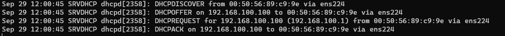

DHCPDISCOVER : Le client envoie une requête de découverte de serveur DHCP.

DHCPOFFER : Le serveur DHCP répond à la requête de découverte en proposant une adresse IP.
DHCPREQUEST : Le client envoie une requête de location d'adresse IP.
DHCPACK : Le serveur DHCP répond à la requête de location en confirmant l'attribution de l'adresse IP.

### 8. Que contient le fichier /var/lib/dhcp/dhcpd.leases sur le serveur, et qu’afficle la commande dhcp-lease-list ?

```bash
sudo cat /var/lib/dhcp/dhcpd.leases
```

Le fichier /var/lib/dhcp/dhcpd.leases contient les informations sur les adresses IP attribuées par le serveur DHCP.

```bash
sudo dhcp-lease-list
To get manufacturer names please download http://standards.ieee.org/regauth/oui/oui.txt to /usr/local/etc/oui.txt
Reading leases from /var/lib/dhcp/dhcpd.leases
MAC                IP              hostname       valid until         manufacturer
===============================================================================================
00:50:56:89:c9:9e  192.168.100.100 -NA-           2022-09-29 12:05:04 -NA-
```
La commande dhcp-lease-list permet d'afficher les informations sur les adresses IP attribuées par le serveur DHCP.

### 9. Vérifiez que les deux machines peuvent communiquer via leur adresse IP, à l’aide de la commande ping.

```bash
ping 192.168.100.100
PING 192.168.100.100 (192.168.100.100) 56(84) bytes of data.
64 bytes from 192.168.100.100: icmp_seq=1 ttl=64 time=0.237 ms
64 bytes from 192.168.100.100: icmp_seq=2 ttl=64 time=0.185 ms
64 bytes from 192.168.100.100: icmp_seq=3 ttl=64 time=0.341 ms
64 bytes from 192.168.100.100: icmp_seq=4 ttl=64 time=0.352 ms
64 bytes from 192.168.100.100: icmp_seq=5 ttl=64 time=0.278 ms
64 bytes from 192.168.100.100: icmp_seq=6 ttl=64 time=1.30 ms
64 bytes from 192.168.100.100: icmp_seq=7 ttl=64 time=0.924 ms
64 bytes from 192.168.100.100: icmp_seq=8 ttl=64 time=0.301 ms
64 bytes from 192.168.100.100: icmp_seq=9 ttl=64 time=0.208 ms
```

### 10. Modifiez la configuration du serveur pour que l’interface réseau du client reçoive l’IP statique 192.168.100.20 :
deny unknown-clients; #empêche l'attribution d'une adresse IP à une
#station dont l'adresse MAC est inconnue du serveur
host client {
hardware ethernet XX:XX:XX:XX:XX:XX; #remplacer par l'adresse MAC
fixed-address 192.168.100.20;
}
Vérifiez que la nouvelle configuration a bien été appliquée sur le client (éventuellement, désactivez
puis réactivez l’interface réseau pour forcer le renouvellement du bail DHCP, ou utilisez la commande
dhclient -v).

Server DHCP:
```bash
sudo nano /etc/dhcp/dhcpd.conf

host client {
        hardware ethernet 00:50:56:89:c9:9e;
        fixed-address 192.168.100.20;
}

sudo systemctl restart isc-dhcp-server
```

Client:
```bash
sudo dhclient -v
```
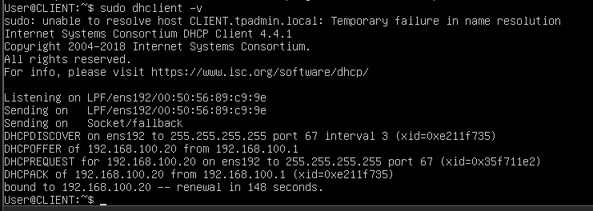

Serveur DHCP:
```bash
ping 192.168.100.20
PING 192.168.100.20 (192.168.100.20) 56(84) bytes of data.
64 bytes from 192.168.100.20: icmp_seq=1 ttl=64 time=0.300 ms
64 bytes from 192.168.100.20: icmp_seq=2 ttl=64 time=0.488 ms
64 bytes from 192.168.100.20: icmp_seq=3 ttl=64 time=0.215 ms
^C
--- 192.168.100.20 ping statistics ---
3 packets transmitted, 3 received, 0% packet loss, time 2037ms
rtt min/avg/max/mdev = 0.215/0.334/0.488/0.114 ms
```

## Exercice 4. Donner un accès à Internet au client
A ce stade, le client est juste une machine sur notre réseau local, et n’a aucun accès à Internet. Pour
remédier à cette situation, on va se servir de la machine serveur (qui, elle, a un accès à Internet via son
autre carte réseau) comme d’une passerelle.

### 1. La première chose à faire est d’autoriser l’IP forwarding sur le serveur (désactivé par défaut, étant donné que la plupart des utilisateurs n’en ont pas besoin). Pour cela, il suffit de décommenter la ligne
net.ipv4.ip_forward=1 dans le fichier /etc/sysctl.conf. Pour que les changements soient pris en
compte immédiatement, il faut saisir la commande sudo sysctl -p /etc/sysctl.conf.
 Vérifiez avec la commande sysctl net.ipv4.ip_forward que la nouvelle valeur a bien été prise en
compte.

```bash
sudo nano /etc/sysctl.conf
  net.ipv4.ip_forward = 1

sudo sysctl -p /etc/sysctl.conf

sysctl net.ipv4.ip_forwardip_forward
net.ipv4.ip_forward = 1
```

### 2. Ensuite, il faut autoriser la traduction d’adresse source (masquerading) en ajoutant la règle iptables
suivante :
sudo iptables --table nat --append POSTROUTING --out-interface enp0s3 -j MASQUERADE
Vérifiez à présent que vous arrivez à « pinguer » une adresse IP (par exemple 1.1.1.1) depuis le client.
A ce stade, le client a désormais accès à Internet, mais il sera difficile de surfer : par exemple, il est même
impossible de pinguer www.google.com. C’est parce que nous n’avons pas encore configuré de serveur DNS
pour le client.

```bash	
sudo iptables --table nat --append POSTROUTING --out-interface ens192 -j MASQUERADE
```

## Exercice 5. Installation du serveur DNS
De la même façon qu’il est plus facile de retenir le nom d’un contact plutôt que son numéro de téléphone,
il est plus simple de mémoriser le nom d’un hôte sur un réseau (par exemple www.cpe.fr) plutôt que son
adresse IP (178.237.111.223).
Dans les premiers réseaux, cette correspondance, appelée résolution de nom, se faisait via un fichier
nommé hosts (présent dans /etc sous Linux 1). L’inconvénient de cette méthode est que lorsqu’un nom ou
une adresse IP change, il faut modifier les fichiers hosts de toutes les machines !
Par conséquent, avec l’avénement des réseaux à grande échelle, ce système n’était plus viable, et une
autre solution, automatisée et centralisée cette fois, a été mise au point : DNS (Domain Name Server).
Généralement, le serveur DNS utilisé est soit celui mis à disposition par le fournisseur d’accès à Internet,
soit un DNS public (comme celui de Google : 8.8.8.8, ou celui de Cloudflare : 1.1.1.1).
Il est aussi très commun d’utiliser un serveur DNS privé, interne à l’organisation, afin de pouvoir résoudre
les noms des machines locales. Pour les requêtes extérieures, le serveur DNS privé passe alors la main à un
DNS externe.
Il existe de nombreux serveurs DNS, mais le plus commun sous UNIX est Bind9 (Berkeley Internet
Name Daemon v.9).

### 1. Sur le serveur, commencez par installer bind9, puis assurez-vous que le service est bien actif.

```bash
sudo apt install bind9
sudo systemctl status bind9
```
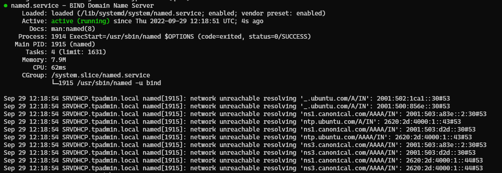

### 2. A ce stade, Bind n’est pas configuré et ne fait donc pas grand chose. L’une des manières les simples de le configurer est d’en faire un serveur cache : il ne fait rien à part mettre en cache les réponses de serveurs externes à qui il transmet la requête de résolution de nom.
 Le binaire (= programme) installé avec le paquet bind9 ne s’appelle ni bind ni bind9 mais named...
Nous allons donc modifier son fichier de configuration : /etc/bind/named.conf.options. Dans ce
fichier, décommentez la partie forwarders, et à la place de 0.0.0.0, renseignez les IP de DNS publics
comme 1.1.1.1 et 8.8.8.8 (en terminant à chaque fois par un point virgule). Redémarrez le serveur
bind9.

```bash
sudo nano /etc/bind/named.conf.options
options {
        directory "/var/cache/bind";

        // If there is a firewall between you and nameservers you want
        // to talk to, you may need to fix the firewall to allow multiple
        // ports to talk.  See http://www.kb.cert.org/vuls/id/800113

        // If your ISP provided one or more IP addresses for stable
        // nameservers, you probably want to use them as forwarders.
        // Uncomment the following block, and insert the addresses replacing
        // the all-0s placeholder.

        forwarders {
                1.1.1.1;
                8.8.8.8;
        };

        //========================================================================
        // If BIND logs error messages about the root key being expired,
        // you will need to update your keys.  See https://www.isc.org/bind-keys
        //========================================================================
        dnssec-validation auto;

        listen-on-v6 { any; };
};

reboot
```

### 3. Sur le client, retentez un ping sur www.google.fr. Cette fois ça devrait marcher ! On valide ainsi la configuration du DHCP effectuée précédemment, puisque c’est grâce à elle que le client a trouvé son serveur DNS.

```bash
ping www.google.fr
```
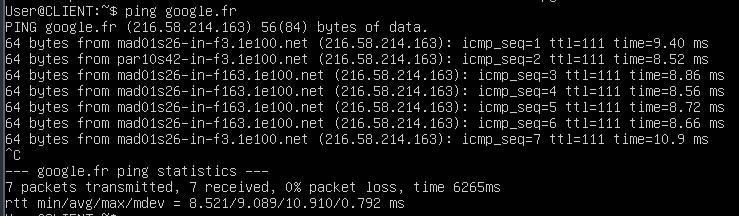

### 4. Sur le client, installez le navigateur en mode texte lynx et essayez de surfer sur fr.wikipedia.org (bienvenue dans le passé...)

```bash
sudo apt install lynx
lynx fr.wikipedia.org
```
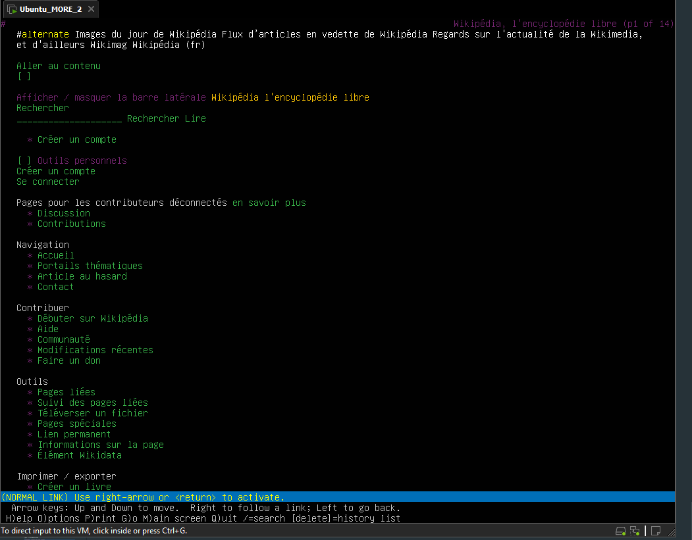

## Exercice 6. Configuration du serveur DNS pour la zone tpadmin.local
L’intérêt d’un serveur DNS privé est principalement de pouvoir résoudre les noms des machines du réseau
local. Pour l’instant, il est impossible de pinguer par leur nom client depuis serveur et inversement.

### 1. Modifiez le fichier /etc/bind/named.conf.local et ajoutez les lignes suivantes :
zone "tpadmin.local" IN {
type master; // c'est un serveur maître
file "/etc/bind/db.tpadmin.local"; // lien vers le fichier de définition de zone
};

```bash
sudo nano /etc/bind/named.conf.local
zone "tpadmin.local" IN {
type master;
file "/etc/bind/db.tpadmin.local";
};
```

### 2. Créez une copie appelée db.tpadmin.local du fichier db.local. Ce fichier est un fichier configuration typique de DNS, constitué d’enregistrements DNS (cf. cours). Dans le nouveau fichier, remplacez toutes les références à localhost par tpadmin local, et l’adresse 127.0.0.1 par l’adresse IP du serveur.


 La ligne root.tpadmin.local. indique en fait une adresse mail du responsable technique de cette zone, où le symbole @ est remplacé par le premier point. Attention également à ne pas oublier le point final, qui représente la racine DNS ; on ne le met pas dans les navigateurs, mais il est indispensable dans les fichiers de configuration DNS !

 Le champ serial doit être incrémenté à chaque modification du fichier. Généralement, on lui donne
pour valeur la date suivie d’un numéro sur deux chiffres, par exemple 2019031401.

```bash
sudo cp /etc/bind/db.local /etc/bind/db.tpadmin.local
sudo nano /etc/bind/db.tpadmin.local

;
; BIND data file for local loopback interface
;
$TTL    604800
@       IN      SOA     tpadmin.local. root.tpadmin.local. (
                              2         ; Serial
                         604800         ; Refresh
                          86400         ; Retry
                        2419200         ; Expire
                         604800 )       ; Negative Cache TTL
;
@       IN      NS      tpadmin.local.
@       IN      A       127.0.0.1
@       IN      AAAA    ::1
srvdhcp IN      A       192.168.100.1
client  IN      A       192.168.100.20

```

### 3. Maintenant que nous avons configuré notre fichier de zone, il reste à configurer le fichier de zone inverse, qui permet de convertir une adresse IP en nom.
Commencez par rajouter les lignes suivantes à la fin du fichier named.conf.local :
zone "100.168.192.in-addr.arpa" {
type master;
file "/etc/bind/db.192.168.100";
};

```bash
sudo nano /etc/bind/named.conf.local
zone "100.168.192.in-addr.arpa" {
type master;
file "/etc/bind/db.192.168.100";
};
```

Créez ensuite le fichier db.192.168.100 à partir du fichier db.127, et modifiez le de la même manière que le fichier de zone. Sur la dernière ligne, faites correspondre l’adresse IP avec celle du serveur
(Attention, il y a un petit piège !).

```bash
sudo cp /etc/bind/db.127 /etc/bind/db.192.168.100
sudo nano /etc/bind/db.192.168.100

;
; BIND reverse data file for local loopback interface
;
$TTL    604800
@       IN      SOA     tpadmin.local. root.tpadmin.local. (
                              1         ; Serial
                         604800         ; Refresh
                          86400         ; Retry
                        2419200         ; Expire
                         604800 )       ; Negative Cache TTL
;
@       IN      NS      localhost.
1       IN      PTR     srvdhcp.tpadmin.local.
20      IN      PTR     client.tpadmin.local.
```


###  4. Utilisez les utilitaires named-checkconf et named-checkzone pour valider vos fichiers de configuration :
$ named-checkconf /etc/bind/named.conf.local
$ named-checkzone tpadmin.local /etc/bind/db.tpadmin.local
$ named-checkzone 100.168.192.in-addr.arpa /etc/bind/db.192.168.100
Modifiez le fichier /etc/systemd/resolved.conf et décommentez la section DNS.

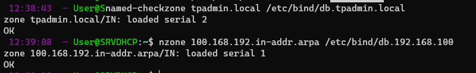

```bash
sudo nano /etc/systemd/resolved.conf
[Resolve]
DNS=
```

### 5. Redémarrer le serveur Bind9. Vous devriez maintenant être en mesure de « pinguer »les différentes machines du réseau.

```bash
sudo systemctl restart bind9
```

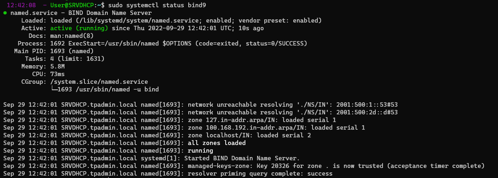

Résulat des pings :
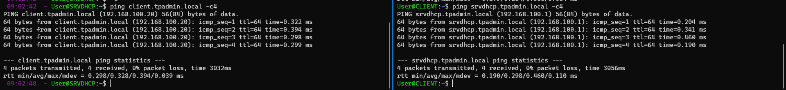
